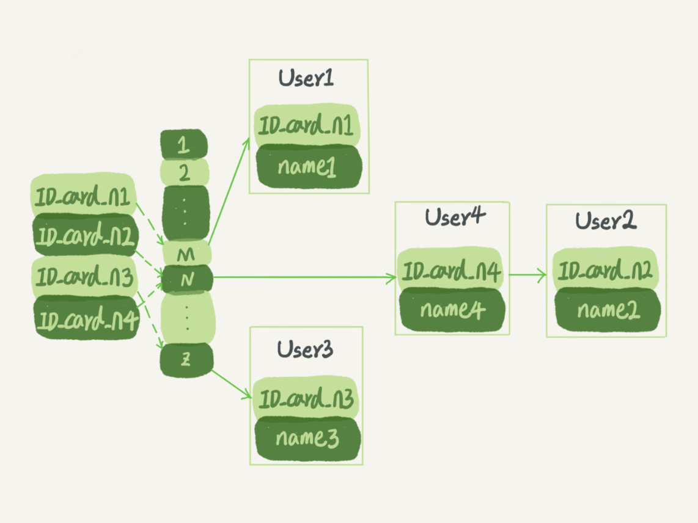

## 深入浅出索引

索引: 为了提高数据查询效率，类似于书的`目录`

### 索引的常见模型

常见的索引类型: `哈希表、有序数组、搜索树`

- 哈希表: 以 键 - 值 (key - value) 存储数据的结构，输入 key找到对应 value，hash table 把 value 放在数组里，用一个哈希函数把 key 换算成确定位置，然后把 value 放在数组的这个位置。多个 key 值经过哈希函数换算会出现 值相同情况，通过拉链表解决哈希冲突。

     假设，你现在维护着一个身份证信息和姓名的表，需要根据身份证号查找对应的名字，这时对应的哈希索引的示意图如下所示：

  

图中，User2 和 User4 根据身份证号算出来的值都是 N，但没关系，后面还跟了一个链表。假设，这时候你要查 ID_card_n2 对应的名字是什么，处理步骤就是：首先，将 ID_card_n2 通过哈希函数算出 N；然后，按顺序遍历，找到 User2。

需要注意的是，图中四个 ID_card_n 的值并不是递增的，这样做的好处是增加新的 User 时速度会很快，只需要往后追加。但缺点是，因为不是有序的，所以哈希索引做区间查询的速度是很慢的。

你可以设想下，如果你现在要找身份证号在[ID_card_X, ID_card_Y]这个区间的所有用户，就必须全部扫描一遍了。

`哈希表适用于只有等值查询的场景，例如 Memcached 及其他一些 NoSQL 引擎。`

有序数组适合等值查询和范围查询，用有序数组实现根据身份证号查名字，如下图所示:


假设身份证号没有重复，该数组按照身份证号递增顺序保存，用`二分查找`可以快速得到，时间复杂度为 `O(log(N))`

同时很显然，这个索引结构支持范围查询。你要查身份证号在[ID_card_X, ID_card_Y]区间的 User，可以先用二分法找到 ID_card_X（如果不存在 ID_card_X，就找到大于 ID_card_X 的第一个 User），然后向右遍历，直到查到第一个大于 ID_card_Y 的身份证号，退出循环。

有序数组查询效率高，但是更新时候需要移动数据位置，成本很高，因此`有序数组索引只适用于静态存储引擎`

用二叉查找树实现根据身份证号查名字:


二叉搜索树: 父节点左子树所有节点的值小于父节点的值，父节点右子树所有节点的值大于父节点的值，查询时间复杂度为 `O(log(N))`

为了让一个查询尽量少地读磁盘，就必须让查询过程访问尽量少的数据块。那么，我们就不应该使用二叉树，而是要使用“N 叉”树。这里，“N 叉”树中的“N”取决于数据块的大小。

以 InnoDB 的一个整数字段索引为例，这个 N 差不多是 1200。这棵树高是 4 的时候，就可以存 1200 的 3 次方个值，这已经 17 亿了。考虑到树根的数据块总是在内存中的，一个 10 亿行的表上一个整数字段的索引，查找一个值最多只需要访问 3 次磁盘。其实，树的第二层也有很大概率在内存中，那么访问磁盘的平均次数就更少了。N 叉树由于在读写上的性能优点，以及适配磁盘的访问模式，已经被广泛应用在数据库引擎中了。

引擎设计中的其他数据结构: `跳表`、`LSM 树`

MySQL 索引在存储引擎层实现，因此没有统一的索引标准，不同存储引擎的索引工作方式不同。

### InnoDB 的存储引擎

InnoDB 中的表根据主键顺序以索引形式存放，这种存储方式成为索引组织表，InnoDB 使用 `B+` 树索引模型，数据都存储在 B+ 树中

每一个索引在 InnoDB 中 对应一棵 B+ 树。

假设，我们有一个主键列为 ID 的表，表中有字段 k，并且在 k 上有索引

```sql

mysql> create table T(
id int primary key, 
k int not null, 
name varchar(16),
index (k))engine=InnoDB;
```

表中 R1~R5 的 (ID,k) 值分别为 (100,1)、(200,2)、(300,3)、(500,5) 和 (600,6)，两棵树的示例示意图如下。


##### 根据叶子节点内容，索引分为`主键索引`和`非主键索引`

主键索引的叶子节点存的是整行数据，在 InnoDB 里，主键索引也被称为`聚簇索引(clustered index)`。

非主键索引的叶子节点内容是主键的值，在 InnoDB 里，非主键索引也被称为 二级索引(secondary index)。

##### 基于主键索引和普通索引的查询有什么区别 ？

- 如果语句是 `select * from T where ID=500`, 即`主键查询`方式，只需要搜索 ID 这棵 B+树；
- 如果语句是 `select * from T where k=5`,即`普通索引查询`方式，  则需要先搜索 k 索引树，得到 ID 的值为500，再到ID 索引树搜索一次，这个过程称为回表。

基于非主键索引的查询需要多扫描一棵索引树，因此尽量用主键查询。

### 索引维护

B+ 树为了维护索引有序性，在插入新值的时候需要做必要的维护。以上面这个图为例，如果插入新的行 ID 值为 700，则只需要在 R5 的记录后面插入一个新记录。如果新插入的 ID 值为 400，就相对麻烦了，需要逻辑上挪动后面的数据，空出位置。

而更糟的情况是，如果 R5 所在的数据页已经满了，根据 B+ 树的算法，这时候需要申请一个新的数据页，然后挪动部分数据过去。这个过程称为页分裂。在这种情况下，性能自然会受影响。

除了性能外，页分裂操作还影响数据页的利用率。原本放在一个页的数据，现在分到两个页中，整体空间利用率降低大约 50%。当然有分裂就有合并。当相邻两个页由于删除了数据，利用率很低之后，会将数据页做合并。合并的过程，可以认为是分裂过程的逆过程。

##### 自增主键使用场景

自增主键是自增列上定义的主键，建表 DDL 通常为:

```sql
NOT NULL PRIMARY KEY AUTO_INCREMENT
```

插入新记录时候可以不指定 ID 的值，系统会获取当前 ID 最大值 +1 作为下一条记录的 ID 值

自增主键的插入数据模式，正符合递增插入场景，每次插入一条新纪录，都是追加操作，不涉及到挪动其他记录，也不会

触发叶子节点的分裂。

有业务逻辑的字段做主键，往往不容易保证有序插入，这样写数据成本相对较高。

##### Q: 从存储空间的角度来看。假设你的表中确实有一个唯一字段，比如字符串类型的身份证号，那应该用身份证号做主键，还是用自增字段做主键呢？

A: 由于每个非主键索引的叶子节点上都是主键的值。如果用身份证号做主键，那么每个二级索引的叶子节点占用约 20 个字节，而如果用整型做主键，则只要 4 个字节，如果是长整型（bigint）则是 8 个字节。

`显然，主键长度越小，普通索引的叶子节点就越小，普通索引占用的空间也就越小。`

所以，从性能和存储空间方面考量，自增主键往往是更合理的选择

##### 适合用业务字段直接做主键的场景

1. 只有一个索引
2. 该索引必须是唯一索引

即典型的 KV 场景，由于没有其他索引，就不用考虑其他索引的叶子节点大小问题。

这时候我们就要优先考虑上一段提到的“尽量使用主键查询”原则，直接将这个索引设置为主键，可以避免每次查询需要搜索两棵树。

B+ 树能够很好地配合磁盘的读写特性，减少单次查询的磁盘访问次数。由于 InnoDB 是索引组织表，一般情况下建议创建一个自增主键，这样非主键索引占用的空间最小。

### Q: 对于上面例子中的 InnoDB 表 T，如果你要重建索引 k，你的两个 SQL 语句可以这么写：

```sql
alter table T drop index k;

alter table T add index(k);
```

如果你要重建主键索引，也可以这么写：

```sql
alter table T drop primary key;

alter table T add primary key(id);
```

对这个两个重建索引的作法，有什么理解

#### A: 重建索引原因

索引能因为删除、或者页分裂等原因，导致数据页有空洞，重建索引的过程会创建一个新的索引，把数据按顺序插入，这样页面的利用率最高，索引更紧凑省空间。

重建索引 k 是合理的，可以省空间。重建主键索引过程不合理，`无论是删除主键还是创建主键，都会将整个表重建，连着执行这两个语句的话，第一个语句就白做了`，可以这样替代:

```sql
alter table T engine=InnoDB
```

## 执行 select * from T where k between 3 and 5，需要执行几次树的搜索操作，会扫描多少行？

表 T ddl

```sql

mysql> create table T (
ID int primary key,
k int NOT NULL DEFAULT 0, 
s varchar(16) NOT NULL DEFAULT '',
index k(k))
engine=InnoDB;

insert into T values(100,1, 'aa'),(200,2,'bb'),(300,3,'cc'),(500,5,'ee'),(600,6,'ff'),(700,7,'gg');
```


以上 SQL 查询执行流程:

1. 在 k 索引树上 找到 k=3 的记录，取得 ID=300;
2. 再到 ID 索引树查到 ID=300 对应的 R3;
3. 在 k 索引树取下一个值 k=5, 取得 ID=500;
4. 再回到 ID 索引树查到 ID=500 对应的 R4;
5. 在 k 索引树取下一个值  k=6,不满足条件，循环结束。

该过程里面 `回到主键索引树搜索的过程，称为回表`，该查询读了 k 索引树的 3条记录(步骤1、3、5)，回表了两次(步骤2和4)

### 覆盖索引

如果执行 `select ID from T where k between 3 and 5` ,此时只需要查 ID 的值，而 ID 已经在 k 索引树上，因此直接提供查询结果不需要回表，也就是说，在这个查询里面，索引 k 已经`覆盖`了我们的查询需求(二级索引包含了查询字段，不需要回表)，称为 `覆盖索引`。

`覆盖索引可以减少树的查询搜索次数，显著提升查询性能，常用于性能优化。`

注意，在引擎内部使用覆盖索引在索引 k 上读了三个记录，R3~R5(对应索引 k 上的记录项)，但是对于 MySQL  的 Server 层来说，它就是找引擎拿到了两条记录，因此 MySQL 认为扫描行数 是 2

#### Q: 在一个市民信息表上，是否有必要将身份证号和名字建立联合索引？

DDL 如下:

```sql

CREATE TABLE `tuser` (
  `id` int(11) NOT NULL,
  `id_card` varchar(32) DEFAULT NULL,
  `name` varchar(32) DEFAULT NULL,
  `age` int(11) DEFAULT NULL,
  `ismale` tinyint(1) DEFAULT NULL,
  PRIMARY KEY (`id`),
  KEY `id_card` (`id_card`),
  KEY `name_age` (`name`,`age`)
) ENGINE=InnoDB
```

- 如果只根据身份证号查询市民信息，只有在身份证号字段加索引就好。
- 如果有高频请求，需要根据市民的身份证号查姓名，建立一个(身份证号、姓名) 就很有意义，在这个高频请求上用到覆盖索引，不再需要回表查整行记录，减少语句的执行时间。
- 索引字段维护有代价，建立冗余索引来支持覆盖索引时候需要权衡考虑。

#### 最左前缀原则

`B+ 树索引结构，可以利用索引的 "最左前缀",来定位记录`

有以下(name,age)联合索引:


索引项按照索引定义里面出现的字段顺序排列

- 当查询所有名字为 "张三"的人时，可以快速定位到 ID4,然后向后遍历得到所有需要的结果。 
- 如果查询所有第一个名字是 "张" 的人，sql 语句条件是 "`where name like '张%'`",此时也可以命中这个索引，查到第一个符合条件的记录是 ID3，然后向后遍历，直到不满足条件为止。
- 不只是索引的全部定义，只要满足`最左前缀`，就可以利用索引来加速检索。这个最左前缀可以是联合索引的最左 N 个字段，也可以是字符串索引的最左 M 个字符。

### Q: 在建立联合索引时候，如何安排索引内的字段顺序

A: 评估标准为索引的复用能力，因为可以支持最左前缀，当已经有 (a,b) 这个联合索引后，一般就不需要单独在 a 上建立索引。因此，`第一原则是，如果通过调整顺序，可以少维护一个索引，那么这个顺序往往是需要优先考虑采用的。`

如果既有联合查询，又有基于 a、b 各自的查询呢? 查询条件里面只有 b  的语句，是无法使用 (a,b) 这个联合索引的，此时不得不为何另外一个索引，也就是同时维护(a,b)、(b) 这两个索引。

这时候就要`考虑的原则是空间`了。比如这个市民表， name 字段比 age 字段 大，建议创建一个 (name,age) 的联合索引 和一个 (age)  的单字段索引。

### 索引下推

如果现在有一个需求: 检索出表中 "名字第一个字是张，而且年龄是10岁的所有男孩"，那么 sql 如下:

```sql
select * from tuser where name like '张%' and age=0 and ismale=1;
```

这个语句在搜索索引树时候，只能用"张",找到第一个满足条件的记录 ID3 ,不过这样总比全表扫描好。

然后判断其他条件是否满足，在 MySQL 5.6之前，只能从 ID3 开始一个个回表，到主键索引上找出数据行，再对比字段值。

Mysql 5.6 引入的 `索引下推优化(index condition pushdown)`,可以在索引遍历过程中，对索引中包含的字段先做判断，直接过滤掉不满足条件的记录，减少回表次数。


以上，每个虚线箭头表示回表一次

图3里面，在(name,age)索引里面特意去掉了 age 的值，这个过程 InnoDB 并不会去看 age 的值，只是按顺序把 "name 第一个字是 '张'  "的记录取出来回表，需要回表 4 次。

图 4 和 图 3 区别是，InnoDB 在 (name,age) 索引内部就判断了 age 是否等于 10，对于不等于 10 的记录，直接判断并跳过。在上面例子里面，只需要对 ID4、ID5 这两条记录进行回表取数据判断，就只需要回表 2 次。

### Q: 主键索引也可以使用多字段，小明有张表 DDL 如下:

```sql

CREATE TABLE `geek` (
  `a` int(11) NOT NULL,
  `b` int(11) NOT NULL,
  `c` int(11) NOT NULL,
  `d` int(11) NOT NULL,
  PRIMARY KEY (`a`,`b`),
  KEY `c` (`c`),
  KEY `ca` (`c`,`a`),
  KEY `cb` (`c`,`b`)
) ENGINE=InnoDB;
```

同事告诉他，因为历史原因，这个表需要a、b 做联合主键，这个小明理解了。

但是他纳闷既然主键包含了a 、b 字段，那意味着单独在字段 c 上创建一个索引，就已经包含了三个字段，为何要创建 "ca"、"cb" 这两个索引?

同事告诉他，因为他们业务场景里面有这样的语句:

```sql
select * from geek where c = N order by a limit 1;
select * from geek where c = N order by b limit 1;
```

这个同事这样解释对吗，为了这两个查询模式，这两个索引是否都是必须的？为什么呢？

### A: 表记录

```sql
–a--|–b--|–c--|–d--
1 2 3 d
1 3 2 d
1 4 3 d
2 1 3 d
2 2 2 d
2 3 4 d
```

主键 a,b 的聚簇索引组织顺序相当于 order by a,b,也就是按 a 排序，再按 b 排序，c 无序。

索引 ca 的组织是先按 c 排序，再按 a 排序，同时记录主键

```
–c--|–a--|–主键部分b-- （注意，这里不是 ab，而是只有 b）
2 1 3
2 2 2
3 1 2
3 1 4
3 2 1
4 2 3
```

这个和索引 c 的数据是一样的

索引 cb 的组织是先按 c 排序，再按 b 排序，同时记录主键

```sql
–c--|–b--|–主键部分a-- （同上）
2 2 2
2 3 1
3 1 2
3 2 1
3 4 1
4 3 2
```

当主键为 (a,b) 时候

定义为 c 的索引，实际上是 (c,a,b)

定义为 (c,a) 的索引，实际上是(c,a,b)

定义为 (c,b) 的索引，实际上是 (c,b,a)